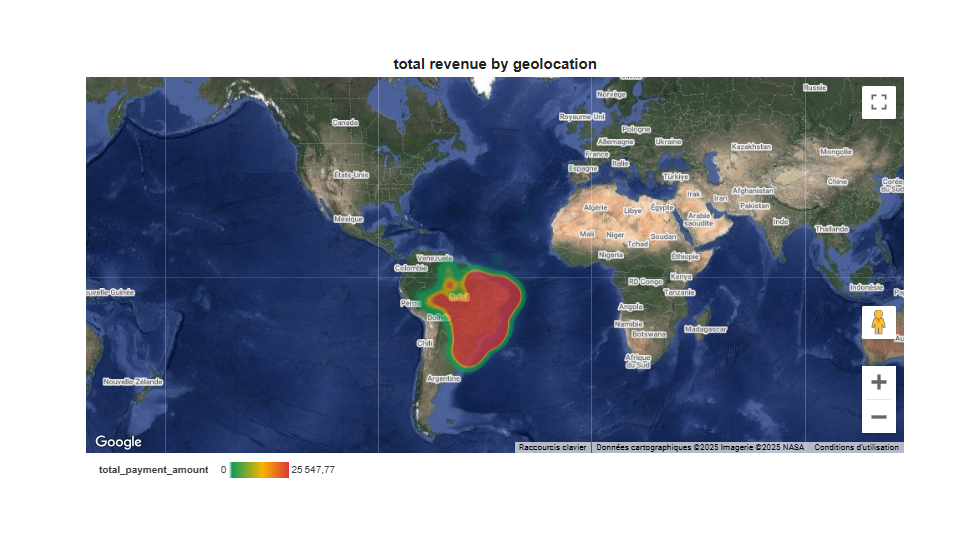

# Head of Data - School Project

## Overview
Final Data course project including data science, webscraping, dataviz (python), SQL and BI viz.

## Path to all the projects
in /notebooks
I have made datascience + analysis project.

in /exercises
I have created all the webscrapping python files (I prefer python over Jupyter Notebooks that is why). The results have all been extracted as CSVs under /data/results.

in /sql
I have created all the sequel files.

BI dashboard is under this link [here](https://lookerstudio.google.com/reporting/0c849da7-9b18-4844-b1f7-3600c978cc4f) 

No need to click on the link everything is provided below as screenshots ! 

## Getting Started
1. Clone the repository
2. Install dependencies: `pip install -r requirements.txt`
3. Open the Jupyter notebooks in the notebooks directory and the python files in the exercises directory
4. Run the cells to see the analysis

Thank you for the course, it was fun and we had a lot of information and support to work on!
